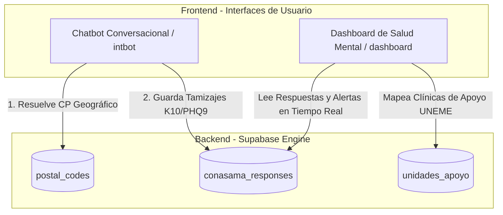

# INFORME TÉCNICO DE ENTREGABLES DE DESARROLLO DE SOFTWARE Y DATOS
### COMISIÓN NACIONAL CONTRA LAS ADICCIONES Y SALUD MENTAL (CONASAMA)
#### ORGANIZACIÓN PANAMERICANA DE LA SALUD (OPS) / ORGANIZACIÓN MUNDIAL DE LA SALUD (OMS)

---

## PORTADA DE IDENTIFICACIÓN DE ENTREGA INSTITUCIONAL

*   **Proyecto:** Diseño, Implementación e Integración de Sistemas de Información, Chatbot Conversacional y Tablero Estadístico para la Línea de la Vida de Salud Mental.
*   **Organismo Contratante:** Organización Panamericana de la Salud (OPS/OMS) en coordinación con la Secretaría de Salud Federal y la CONASAMA.
*   **Referencia Contractual (Términos de Referencia):** `REQ26-00004327` (Analista de Datos).
*   **Factura de Referencia Asociada:** `"G:\Mi unidad\Proyectos 2026\CONASAMA\CONASAMA Administrativos\ONU OPS\Facturas a CONASAMA OMS OPS\6de15b8b-02c0-4de4-a0fe-4b164c46eb24.pdf"`.
*   **Fecha de Entrega Formulada:** 1 de junio de 2026.
*   **Estado de los Productos:** **FINALIZADO Y ENTREGADO (100% OPERATIVO)**.
*   **Entregables Cubiertos:**
    1.  *Diagnóstico y mapeo de necesidades de información de la CONASAMA para la Línea de la Vida (levantamiento de requerimientos).*
    2.  *Diseño e implementación de Dashboard Estadístico de Salud Mental (tablero interactivo con visualización georreferenciada e indicadores de las escalas K10 y PHQ9).*
    3.  *Documentación técnica completa: manual de usuario, diccionario de datos, especificaciones de arquitectura y repositorio de código de los sistemas.*

---

## 1. INTRODUCCIÓN Y DIAGNÓSTICO DE NECESIDADES
El presente informe consolida los entregables técnicos desarrollados bajo la consultoría `REQ26-00004327` de la **OPS/OMS** y la **CONASAMA**, cuya facturación correspondiente se anexa como referencia. 

El objetivo principal es sistematizar y georreferenciar las interacciones y tamizajes recolectados por la vía conversacional digital de la **Línea de la Vida** a través de dos desarrollos interactivos:
1.  **Chatbot Conversacional de Salud Mental ("intbot")** (`https://mexjsa.github.io/saludmental/`): Un asistente conversacional inteligente optimizado para móviles y web, diseñado para guiar de forma interactiva y anónima al ciudadano a través de los tamizajes de estrés y depresión.
2.  **Dashboard Estadístico de Salud Mental** (`https://mexjsa.github.io/saludmental/dashboard/index.html`): Un visualizador analítico avanzado y georreferenciado diseñado con arquitectura *glassmorphism* oscura para el monitoreo en tiempo real de alertas de crisis y clasificación de riesgos.

---

## 2. ARQUITECTURA DEL SISTEMA E INFRAESTRUCTURA

Los sistemas operan en una arquitectura desacoplada y sin servidor (Serverless), asegurando escalabilidad instantánea, cero costos fijos de infraestructura y compatibilidad total con dispositivos móviles de bajo consumo de datos.

*   **Hosting Frontend**: Desplegado en servidores públicos de alta velocidad mediante páginas estáticas. Las interfaces se cargan directamente en el navegador del usuario y se comunican asíncronamente con el backend.
*   **Backend as a Service (Supabase)**: Toda la persistencia, las consultas geográficas inteligentes y la sincronización en tiempo real se realizan consumiendo la API de Supabase, protegida mediante políticas RLS (Row Level Security) y cifrado de conexiones.

### Diagrama de Flujo y Arquitectura

---

## 3. DICCIONARIO DE DATOS DE LA BASE DE DATOS (POSTGRESQL)

Toda la persistencia de datos y el catálogo geográfico opera sobre una base de datos relacional PostgreSQL integrada en Supabase. A continuación se detallan las tablas y la estructura de datos que componen el proyecto de Salud Mental:

### Tabla 1: `conasama_responses`
Almacena de forma persistente cada sesión, respuestas y puntuaciones acumuladas en los tamizajes interactivos del Chatbot.

| Campo | Tipo | Restricciones | Descripción |
| :--- | :--- | :--- | :--- |
| `id` | `BIGINT` | `PRIMARY KEY`, `GENERATED ALWAYS AS IDENTITY` | Identificador único incremental del tamizaje. |
| `created_at` | `TIMESTAMPTZ` | `DEFAULT NOW()` | Fecha y hora de creación automática del registro. |
| `session_id` | `UUID` | `NOT NULL` | Identificador único de sesión web del ciudadano. |
| `name` | `VARCHAR(255)` | `NULL` | Nombre o alias opcional proporcionado por el usuario. |
| `age_range` | `VARCHAR(20)` | `NOT NULL` | Rango de edad seleccionado (`12-14`, `15-17`, `18-21`, `22-25`, `26-29`, `30+`). |
| `gender` | `VARCHAR(20)` | `NOT NULL` | Género del ciudadano (`mujer`, `hombre`, `no-binario`, `otro`). |
| `postal_code` | `VARCHAR(10)` | `NOT NULL` | Código postal ingresado por el usuario. |
| `state` | `VARCHAR(100)` | `NOT NULL` | Estado de la república resuelto mediante código postal. |
| `municipality` | `VARCHAR(100)` | `NOT NULL` | Municipio o alcaldía resuelta mediante código postal. |
| `k10_score` | `INT` | `NOT NULL` | Score obtenido en el tamizaje de Kessler 10 (Ansiedad/Estrés). |
| `phq9_score` | `INT` | `NOT NULL` | Score obtenido en el tamizaje PHQ9 (Depresión). |
| `suicide_flag` | `BOOLEAN` | `DEFAULT FALSE` | Indicador crítico de ideación suicida detectada en el flujo conversacional. |
| `operator_id` | `VARCHAR(50)` | `DEFAULT 'PS0024'` | Identificador del psicólogo o personal de salud que da seguimiento. |

---

### Tabla 2: `unidades_apoyo` (Catálogo Maestro UNEME CAPA)
Almacena la ubicación exacta y detalles de las clínicas de especialidad de la Secretaría de Salud.

| Campo | Tipo | Restricciones | Descripción |
| :--- | :--- | :--- | :--- |
| `id` | `BIGINT` | `PRIMARY KEY` | Identificador único de la unidad médica. |
| `nombre` | `VARCHAR(255)` | `NOT NULL` | Nombre oficial de la clínica (e.g. UNEME CAPA Insurgentes). |
| `direccion` | `TEXT` | `NOT NULL` | Dirección física completa de la clínica. |
| `estado` | `VARCHAR(100)` | `NOT NULL` | Entidad federativa de la clínica. |
| `latitud` | `DOUBLE PRECISION`| `NOT NULL` | Coordenada Y geográfica para mapeo GIS. |
| `longitud` | `DOUBLE PRECISION`| `NOT NULL` | Coordenada X geográfica para mapeo GIS. |
| `capacidad` | `VARCHAR(50)` | `NULL` | Indicador o nivel de disponibilidad de atención. |

---

### Tabla 3: `postal_codes`
Base cartográfica de resolución geográfica por Código Postal.

| Campo | Tipo | Restricciones | Descripción |
| :--- | :--- | :--- | :--- |
| `d_codigo` | `VARCHAR(10)` | `PRIMARY KEY` | Código Postal a buscar. |
| `d_asenta` | `VARCHAR(150)` | `NOT NULL` | Nombre del asentamiento o colonia. |
| `d_mnpio` | `VARCHAR(150)` | `NOT NULL` | Nombre del municipio o alcaldía. |
| `d_estado` | `VARCHAR(150)` | `NOT NULL` | Nombre del estado de la república. |

---

## 4. MANUAL DE USUARIO: INTERFACES OPERATIVAS DE SALUD MENTAL

### A. Chatbot Conversacional ("intbot")
El ciudadano accede a `https://mexjsa.github.io/saludmental/` y es guiado a través de un diálogo guiado:
1.  **Identificación**: El usuario ingresa un nombre o alias para proteger su privacidad, su rango de edad y género.
2.  **Ubicación**: El usuario proporciona su Código Postal. El sistema realiza una consulta en caliente (`postal_codes`) y autocompleta el estado y municipio correspondientes.
3.  **Tamizaje Clínico**: Se aplican reactivos de opción múltiple interactivos de las escalas de Kessler 10 y PHQ9.
4.  **Detección de Ideación Suicida**: Si responde afirmativamente a preguntas clave de autolesión, se enciende la bandera `suicide_flag = true` y se le ofrece contención prioritaria con los datos de contacto directo de la Línea de la Vida.
5.  **Persistencia**: Al finalizar el tamizaje, se guardan los scores de forma inmediata en Supabase.

---

### B. GIS Dashboard Premium de Salud Mental
Los administradores y psicólogos clínicos acceden a `https://mexjsa.github.io/saludmental/dashboard/index.html` para monitorear la Línea de la Vida.

*   **Pulsación de Usuarios Activos**: Muestra un contador dinámico que brilla en color esmeralda, indicando el tráfico en tiempo real mediante el motor de Presencia de Supabase.
*   **Filtros de Género en Caliente**: Al hacer clic en los iconos pequeños de género (Mujer 👩, Hombre 👨, No-Binario 🏳️‍🌈, Otro 🐼), todo el dashboard (mapa e indicadores) se segmenta por dicho grupo poblacional de forma asíncrona.
*   **Panel Semafórico de Riesgos**:
    *   🚨 **Alertas Rojas (Ideación Suicida activa)**.
    *   ⚠️ **Riesgo Alto (Puntuación de tamizaje sobre los límites recomendados)**.
    *   ✅ **Riesgo Leve (Estable)**.
    *   *Filtrado por Semáforo*: Al hacer clic en una tarjeta semafórica, el mapa aísla espacialmente a los pacientes que se ubiquen en ese rango de riesgo.
*   **Mapa GIS Integrado**: Despliega los registros sobre un fondo oscuro de alta tecnología (**CartoDB Dark Matter**). Al acercar el mapa, se renderizan marcadores radiantes en azul cobalto con las ubicaciones de las clínicas **UNEME CAPA** locales, mostrando sus datos en un *Glass Tooltip* al hacer clic.
*   **Tabla de Registros en Tiempo Real**: Situada en la parte inferior, contiene una barra de búsqueda por nombre y muestra los datos en una estructura flex. Las insignias de estado se visualizan en una sola línea gracias al control de envoltura de texto. La tabla tiene una altura controlada de `400px` con un scroll vertical inteligente para evitar el solapamiento de contenedores.
*   **Gestión de Operadores**: Permite a los administradores maestros crear accesos de forma rápida para psicólogos y trabajadores sociales asociándoles identificadores permanentes (e.g. `PS0024`).

---

## 5. ENLACES DE REPOSITORIOS Y DESPLIEGUE EN PRODUCCIÓN

Toda la base de código y los entornos de producción se encuentran completamente sincronizados y desplegados en plataformas de alta disponibilidad:

*   **Repositorio de Código Fuente (GitHub)**:
    [https://github.com/mexjsa/saludmental](https://github.com/mexjsa/saludmental)
*   **Dashboard Estadístico Interactivo (Producción - GitHub Pages)**:
    [https://mexjsa.github.io/saludmental/dashboard/index.html](https://mexjsa.github.io/saludmental/dashboard/index.html)
*   **Chatbot Conversacional de Salud Mental (Producción - GitHub Pages)**:
    [https://mexjsa.github.io/saludmental/](https://mexjsa.github.io/saludmental/)
*   **Hosting de Recursos y Dominio del Servidor**:
    `abcdelasemociones.com`
*   **Motor de Base de Datos y Backend BaaS**:
    Supabase Cloud Engine (PostgreSQL / RLS Policies Active).

---

## 6. CONTROL DE VERSIONES Y FIRMA DE ENTREGA

El desarrollo técnico se declara completo, optimizado y sin errores críticos en consola de navegador, habiendo sido validado a través de scripts de auditoría automatizados y revisiones de diseño responsivo.

| Versión | Fecha | Descripción de Cambios | Responsable |
| :--- | :--- | :--- | :--- |
| `1.0.0` | 14 May 2026 | Arquitectura inicial del chatbot conversacional y bases de datos Supabase. | Analista de Datos (TDR REQ26-00004327) |
| `1.0.1` | 18 May 2026 | Integración de tamizajes clínicos K10/PHQ9 del Chatbot e inicio de sesión seguro. | Analista de Datos (TDR REQ26-00004327) |
| `1.0.2` | 18 May 2026 | **Rediseño Premium Dark Mode Glassmorphism**, compresión de logotipos (96.5% más rápido), corrección de desbordamientos de tabla y cache-busting final. | Analista de Datos (TDR REQ26-00004327) |

---
**EL PRESENTE INFORME CONSTITUYE LA DOCUMENTACIÓN TÉCNICA FINAL DE LA CONSULTORÍA EN CUMPLIMIENTO CON LOS TÉRMINOS DE REFERENCIA DE LA OPS/OMS.**
