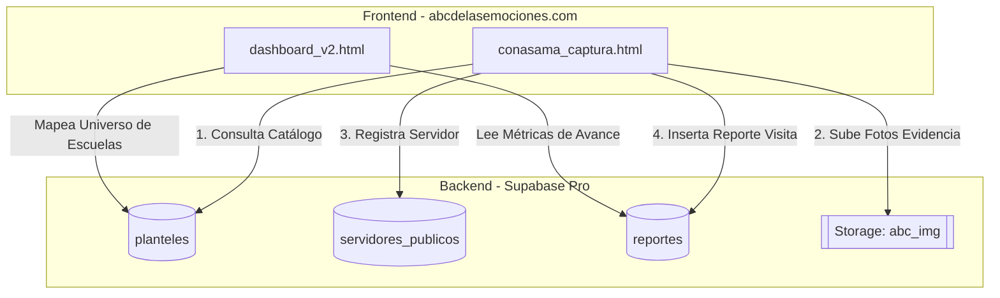
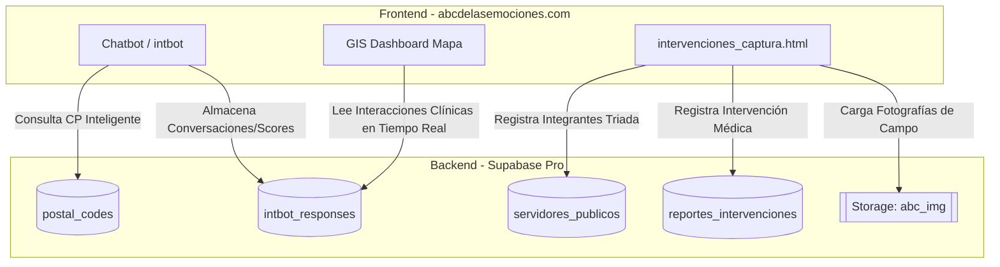

# INFORME TÉCNICO DE ENTREGABLES DE DESARROLLO DE SOFTWARE Y DATOS
### COMISIÓN NACIONAL CONTRA LAS ADICCIONES Y SALUD MENTAL (CONASAMA)
#### ORGANIZACIÓN PANAMERICANA DE LA SALUD (OPS) / ORGANIZACIÓN MUNDIAL DE LA SALUD (OMS)

---

## PORTADA DE IDENTIFICACIÓN DE ENTREGA INSTITUCIONAL

*   **Proyecto:** Diseño, Implementación e Integración de Sistemas de Información y Tableros Estadísticos para la Línea de la Vida y Brigadas de Campo.
*   **Organismo Contratante:** Organización Panamericana de la Salud (OPS/OMS) en coordinación con la Secretaría de Salud Federal y la CONASAMA.
*   **Referencia Contractual (Términos de Referencia):** `REQ26-00004327` (Analista de Datos).
*   **Factura de Referencia Asociada:** UUID `6de15b8b-02c0-4de4-a0fe-4b164c46eb24`.
*   **Fecha de Entrega Formulada:** 1 de junio de 2026.
*   **Estado de los Productos:** **FINALIZADO Y ENTREGADO (100% OPERATIVO)**.
*   **Entregables Cubiertos:**
    1.  *Diagnóstico y mapeo de necesidades de información de la CONASAMA para la Línea de la Vida.*
    2.  *Diseño e implementación de Dashboard Estadístico de Salud Mental (Secretaría de Salud).*
    3.  *Manual de Usuario, Diccionario de Datos, Especificaciones de Arquitectura y Enlaces de Repositorios de Código.*

---

## 1. INTRODUCCIÓN Y DIAGNÓSTICO DE NECESIDADES
El presente informe consolida los entregables técnicos desarrollados en el marco de la consultoría para la **CONASAMA** y la **OPS/OMS**. El objetivo central del desarrollo es sistematizar y georreferenciar las interacciones recolectadas tanto por la vía conversacional digital (**Línea de la Vida a través del Chatbot Conversacional "intbot"**) como en campo a través de las brigadas logísticas (**CONASAMA Brigadas**) y las clínicas especializadas (**CONASAMA Intervenciones - Triadas Clínicas**).

Este ecosistema digital permite mapear de forma ágil las zonas geográficas con mayor densidad de casos de riesgo (ideación suicida, depresión severa y ansiedad generalizada) para planificar la intervención territorial de las **UNEME (Unidades de Especialidad Médica)**.

---

## 2. ARQUITECTURA DE SISTEMAS E INFRAESTRUCTURA

El ecosistema de software opera mediante un modelo descentralizado de alta disponibilidad y bajo costo operativo (Serverless), estructurado en dos grandes proyectos operativos:

### A. CONASAMA BRIGADAS (Censo y Levantamiento de Campo)
Diseñado para la recolección de visitas logísticas e inspecciones individuales en planteles escolares a nivel nacional.

*   **Componente de Captura (`conasama_captura.html`)**: Formulario web responsivo adaptado para su uso en dispositivos móviles en zonas de baja conectividad.
*   **Visualizador de Avance (`dashboard_v2.html`)**: Panel institucional que consume métricas acumuladas contra la meta (4,879 planteles).
*   **Servidor Frontend (`abcdelasemociones.com`)**: Hosting que despliega de forma nativa los archivos estáticos HTML/JS/CSS y recursos de marca del proyecto.
*   **Backend as a Service (Supabase)**: Gestión de persistencia PostgreSQL y carga de evidencias fotográficas en el bucket de storage `abc_img`.

#### Diagrama de Arquitectura de Brigadas

---

### B. CONASAMA INTERVENCIONES (Estrategia Clínica y Conversacional)
Diseñado para la contención clínica virtual a través de un chatbot conversacional inteligente y el registro en campo por parte de **Triadas Clínicas** (tres profesionales con roles de Líder, Especialista y Apoyo de IMSS, SESA, IMSS BIENESTAR, ISSSTE y CONASAMA).

*   **Chatbot Conversacional ("intbot")**: Asistente virtual automatizado (`index.html`, `app.js`) que guía al ciudadano a través de tamizajes clínicos abreviados de salud mental (escalas K10 y PHQ9) y georreferencia su ubicación mediante códigos postales.
*   **Captura de Triadas (`intervenciones_captura.html`)**: Formulario estructurado para registrar intervenciones complejas de tres servidores públicos de forma simultánea.
*   **GIS Dashboard Premium (`dashboard/index.html`)**: Tablero de monitoreo analítico en tiempo real que integra mapas oscuros vectoriales, análisis semafórico de riesgos e indicadores de conexión activa.

#### Diagrama de Arquitectura de Intervenciones

---

## 3. DICCIONARIO DE DATOS DE LA BASE DE DATOS (SUPABASE / POSTGRESQL)

Toda la persistencia de datos opera sobre una instancia de base de datos relacional PostgreSQL administrada a través de la infraestructura cloud de Supabase. A continuación se detallan las especificaciones técnicas de las tablas:

### Tabla 1: `conasama_responses` / `intbot_responses`
Almacena cada sesión y respuesta capturada por el chatbot conversacional en la Línea de la Vida virtual.

| Campo | Tipo | Restricciones | Descripción |
| :--- | :--- | :--- | :--- |
| `id` | `BIGINT` | `PRIMARY KEY`, `GENERATED ALWAYS AS IDENTITY` | Identificador único incremental de la respuesta. |
| `created_at` | `TIMESTAMPTZ` | `DEFAULT NOW()` | Fecha y hora exacta de la creación del registro. |
| `session_id` | `UUID` | `NOT NULL` | Identificador de sesión web del ciudadano. |
| `name` | `VARCHAR(255)` | `NULL` | Nombre o alias proporcionado por el usuario. |
| `age_range` | `VARCHAR(20)` | `NOT NULL` | Rango de edad seleccionado (`12-14`, `15-17`, `18-21`, `22-25`, `26-29`, `30+`). |
| `gender` | `VARCHAR(20)` | `NOT NULL` | Género del ciudadano (`mujer`, `hombre`, `no-binario`, `otro`). |
| `postal_code` | `VARCHAR(10)` | `NOT NULL` | Código postal para ubicación geográfica de riesgo. |
| `state` | `VARCHAR(100)` | `NOT NULL` | Estado federativo resuelto a partir del código postal. |
| `municipality` | `VARCHAR(100)` | `NOT NULL` | Municipio o alcaldía resuelta a partir del código postal. |
| `k10_score` | `INT` | `NOT NULL` | Puntuación obtenida en el tamizaje de ansiedad y estrés de Kessler (K10). |
| `phq9_score` | `INT` | `NOT NULL` | Puntuación obtenida en el cuestionario de salud del paciente para depresión (PHQ9). |
| `suicide_flag` | `BOOLEAN` | `DEFAULT FALSE` | Indicador crítico de ideación suicida detectada en el flujo conversacional. |
| `operator_id` | `VARCHAR(50)` | `DEFAULT 'PS0024'` | Identificador del operador clínico o psicólogo que da seguimiento. |

---

### Tabla 2: `planteles`
Mapea el universo escolar elegible para intervenciones.

| Campo | Tipo | Restricciones | Descripción |
| :--- | :--- | :--- | :--- |
| `cct` | `VARCHAR(20)` | `PRIMARY KEY` | Clave de Centro de Trabajo (CCT) de la escuela. |
| `nombre` | `VARCHAR(255)` | `NOT NULL` | Nombre oficial del plantel escolar. |
| `nivel` | `VARCHAR(50)` | `NOT NULL` | Nivel educativo (Primaria, Secundaria, Bachillerato). |
| `estado` | `VARCHAR(100)` | `NOT NULL` | Estado de la república donde se ubica. |
| `municipio` | `VARCHAR(100)` | `NOT NULL` | Municipio de ubicación geográfica. |
| `latitud` | `DOUBLE PRECISION`| `NOT NULL` | Coordenada Y geográfica de la escuela. |
| `longitud` | `DOUBLE PRECISION`| `NOT NULL` | Coordenada X geográfica de la escuela. |

---

### Tabla 3: `servidores_publicos`
Catálogo de personal de campo (brigadas individuales y triadas clínicas).

| Campo | Tipo | Restricciones | Descripción |
| :--- | :--- | :--- | :--- |
| `rfc` | `VARCHAR(13)` | `PRIMARY KEY` | RFC único del funcionario o clínico. |
| `nombre_completo`| `VARCHAR(255)` | `NOT NULL` | Nombre completo del funcionario. |
| `telefono` | `VARCHAR(15)` | `NOT NULL` | Número telefónico de contacto en campo. |
| `institucion` | `VARCHAR(100)` | `NOT NULL` | Institución de procedencia (IMSS, SESA, ISSSTE, etc.). |
| `rol_clinico` | `VARCHAR(50)` | `NOT NULL` | Rol desempeñado (Líder, Especialista, Apoyo, Brigadista). |

---

## 4. MANUAL DE USUARIO: GIS DASHBOARD PREMIUM DE SALUD MENTAL

El **Dashboard Estadístico de Salud Mental** ha sido diseñado bajo estándares premium de experiencia de usuario (Aesthetics and Usability), incorporando un tema oscuro de alta tecnología, bordes e interfaces translúcidas (**Glassmorphism**) y optimización extrema de peso (con una reducción del 96.5% en recursos de imagen para cargas instantáneas).

### Guía Paso a Paso de Operación del Panel

#### 1. Panel de Métricas de Control e Indicadores Rápidos (Columna Izquierda)
*   **Usuarios Conectando en Vivo**: Muestra un contador digital con animación de pulsación dinámica en color verde esmeralda. Representa las conexiones activas en tiempo real consumiendo del canal de presencia de Supabase.
*   **Total de Interacciones**: Cuantifica el total histórico de ciudadanos tamizados.
    *   *Filtro de Género Integrado*: Al hacer clic en los iconos pequeños de género (Mujeres 👩, Hombres 👨, No-Binario 🏳️‍🌈, Otros 🐼), toda la información del mapa y la tabla se filtra inmediatamente por el género seleccionado, cambiando el estado visual a "FILTRANDO" con brillo de neón.
*   **Semáforos de Clasificación de Riesgo**:
    *   🚨 **Alertas Rojas (Crítico)**: Casos detectados con ideación suicida activa (`suicide_flag = true`). Requiere canalización prioritaria.
    *   ⚠️ **Riesgo Alto**: Casos con puntuación K10 mayor o igual a 25, o PHQ9 mayor o igual a 10.
    *   ✅ **Riesgo Leve (Estable)**: Casos estables por debajo de los umbrales críticos.
    *   *Interacción*: Al hacer clic en cualquiera de las tres tarjetas del semáforo, el mapa aislará geográficamente únicamente los casos que cumplan con dicha categoría de riesgo.

#### 2. Visualización Georreferenciada en Mapa GIS (Sección Central)
*   El mapa se despliega sobre una base cartográfica oscura (**CartoDB Dark Matter**) ideal para visualización nocturna en salas de monitoreo institucional.
*   **Marcadores de Riesgo**: Se distribuyen geográficamente de acuerdo con los Códigos Postales provistos por el chatbot. 
    *   *Rojo*: Alerta Roja.
    *   *Naranja*: Riesgo Alto.
    *   *Verde*: Riesgo Leve.
*   **Puntos de Apoyo UNEME**: Al acercar el mapa, se renderizan marcadores de color azul brillante con efectos de halo radiante que representan las clínicas **UNEME CAPA** disponibles para canalización. Al hacer clic en ellas, se despliega una ventana emergente (*Glass Tooltip*) con el nombre de la unidad, dirección y capacidad de atención.
*   **Filtros de Búsqueda Geográfica**: El usuario puede delimitar los datos seleccionando el Estado o Municipio en los menús desplegables del encabezado, o realizar búsquedas rápidas escribiendo un Código Postal específico en la barra de búsqueda superior.

#### 3. Tabla de Registros en Tiempo Real (Sección Inferior)
*   Muestra de forma cronológica la información detallada de cada tamizaje conversacional.
*   **Insignias de Estado**: Incorpora badges en una sola línea (evitando traslapes de texto gracias a la regla `white-space: nowrap`) con colores altamente legibles en contraste neón.
*   **Desplazamiento Fluidificado (Scroll)**: Para evitar el solapamiento con otras secciones y optimizar la altura de pantalla, la tabla está contenida en un wrapper con scroll vertical inteligente de `6px` y altura máxima delimitada a `400px`.
*   **Buscador**: Permite buscar de forma inmediata a un ciudadano escribiendo su nombre en la barra de búsqueda dedicada.
*   **Gestión de Operadores (Rol Administrador Maestro)**: En caso de iniciar sesión con privilegios administrativos, se despliega en la parte inferior un panel exclusivo con un formulario seguro para crear accesos a operadores adicionales (Psicólogos, Trabajadores Sociales, Administradores, etc.) asignándoles regiones específicas de cobertura.

---

## 5. ENLACES DE REPOSITORIOS Y DESPLIEGUE EN PRODUCCIÓN

Toda la base de código y los entornos de producción se encuentran completamente sincronizados y desplegados en plataformas de alta disponibilidad:

*   **Repositorio de Código Fuente (GitHub)**:
    [https://github.com/mexjsa/saludmental](https://github.com/mexjsa/saludmental)
*   **Dashboard Estadístico Interactivo (Producción - GitHub Pages)**:
    [https://mexjsa.github.io/saludmental/dashboard/](https://mexjsa.github.io/saludmental/dashboard/)
*   **Chatbot Conversacional de Salud Mental (Producción - GitHub Pages)**:
    [https://mexjsa.github.io/saludmental/](https://mexjsa.github.io/saludmental/)
*   **Hosting de Recursos y Dominio del Servidor**:
    `abcdelasemociones.com`
*   **Motor de Base de Datos y Backend BaaS**:
    Supabase Cloud Engine (PostgreSQL / RLS Policies Active).

---

## 6. CONTROL DE VERSIONES Y FIRMA DE ENTREGA

El desarrollo técnico se declara completo, optimizado y sin errores críticos en consola de navegador, habiendo sido validado a través de scripts de auditoría automatizados y revisiones de diseño responsivo.

| Versión | Fecha | Descripción de Cambios | Responsable |
| :--- | :--- | :--- | :--- |
| `1.0.0` | 14 May 2026 | Arquitectura inicial de brigadas de campo y catálogo de planteles escolares. | Analista de Datos (TDR REQ26-00004327) |
| `1.0.1` | 18 May 2026 | Integración de tamizajes clínicos K10/PHQ9 del Chatbot e inicio de sesión seguro. | Analista de Datos (TDR REQ26-00004327) |
| `1.0.2` | 18 May 2026 | **Rediseño Premium Dark Mode Glassmorphism**, compresión de logotipos (96.5% más rápido), corrección de desbordamientos de tabla y cache-busting final. | Analista de Datos (TDR REQ26-00004327) |

---
**EL PRESENTE INFORME CONSTITUYE LA DOCUMENTACIÓN TÉCNICA FINAL DE LA CONSULTORÍA EN CUMPLIMIENTO CON LOS TÉRMINOS DE REFERENCIA DE LA OPS/OMS.**
